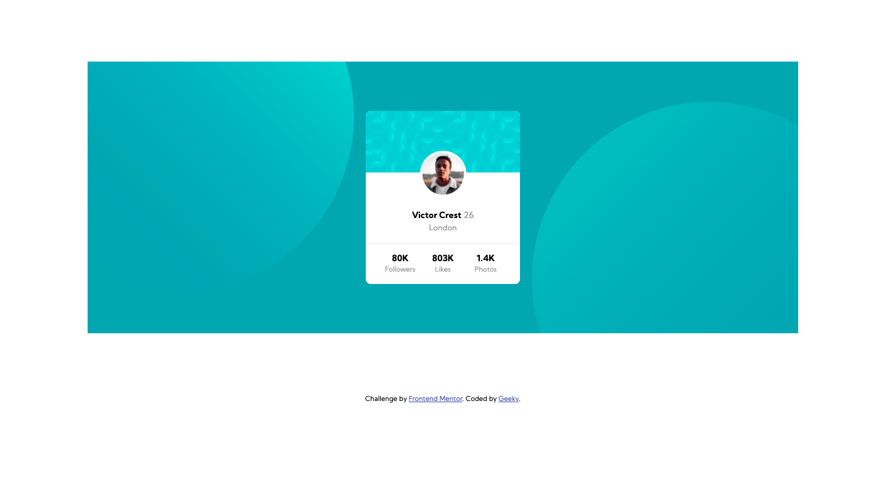

# Frontend Mentor - Profile card component solution

This is a solution to the [Profile card component challenge on Frontend Mentor](https://www.frontendmentor.io/challenges/profile-card-component-cfArpWshJ). Frontend Mentor challenges help you improve your coding skills by building realistic projects. 

## Table of contents

- [Overview](#overview)
  - [The challenge](#the-challenge)
  - [Screenshot](#screenshot)
  - [Links](#links)
- [My process](#my-process)
  - [Built with](#built-with)
  - [What I learned](#what-i-learned)
- [Author](#author)
- [Acknowledgments](#acknowledgments)

## Overview

### The challenge

- Build out the project to the designs provided

### Screenshot

- Desktop Screenshot
  

### Links

- [Solution URL](https://github.com/geeky-amat/profile-card-component-main)
- [Live Site URL](https://geeky-amat.github.io/profile-card-component-main/)

## My process

### Built with

- Semantic HTML5 markup
- CSS custom properties
- Flexbox


### What I learned

- I learnt was that more than one background images could be added in a section.
- Also learnt that images are inline objects just like text and have previously defined padding-bottom even if we don't give it explicitly to accomodate the descenders (eg. 'g', 'j', 'y' etc) . To get rid of the padding-bottom, some rules that could be used are
```css
.image-container {
  line-height: 0;
  font-size: 0;
}
```
or
```css
img {
  vertical-align: top;
}
```
or
```css
img {
  display: block;  /* display: inline-block; won't do the job */
}
```
- The image in .svg format doesn't seem to follow 'height' property in css exactly (rather it is more concerned about maintaining its original aspect ratio) if the units are in percentages but if it is in px units, it works fine. Same isn't the case with 'width'.
- The 'object-fit' property doesn't work with .svg images.
- One difference between border and outline is that outline is with reference to the original object even if the object has been rounded off at corners by giving a border-radius whereas border is with reference to the trimmed version of the object. Got to know this while implementing the white 'border' on the profile picture. Interestingly, this difference doesn't seem to be present in 'Mozilla Firefox' web browser.


## Author

Geeky

## Acknowledgments

Mostly, I got my doubts cleared from youtube videos and stack exchanges Q&A.
